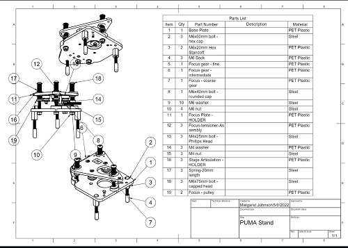
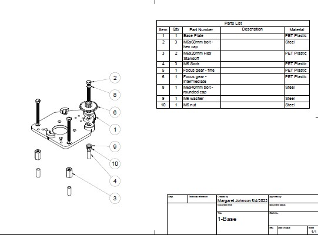

# What the Heck?
I am exploring how good of a microscope can be made using mostly 3D parts.  Heck, it works for my Prusa Printer....Oh and, of course learning for the sheer exhilaration of it all.
# Welcome
Who needs Virtual Reality when there is a whole world of tiny creatures dashing around a soil sample.  I wanted a microscope that I could evolve over time to self adjust focus, detect movement and track the little critters as they dash about,..., all digitally captured.  I ran across [the PUMA project](https://www.optarc.co.uk/products/puma-products/) by Dr. Paul J. Tadross and decided to try putting together the PUMA DIY microscope.  A person with expertese in microscopy has the passion to open source a DIY microscope and also make a small business out of it. On to answer the burning questions -  _how hard can it be to make a Puma microscope?_  I guess _as hard as I make it_. So off I go!
# Resources
- [Unboxing the PUMA Foundation Scope YouTube video](https://www.youtube.com/watch?v=EfecD0UGLDQ)
- [Intro to the PUMA microscope YouTube video](https://www.youtube.com/watch?v=7UbkrZyNgpo)
- [Assembling the PUMA Foundation Scope YouTube video](https://www.youtube.com/watch?v=C-2vRsHi46c)
- [Puma Github site](https://github.com/TadPath/PUMA).  
    - [The CAD files](https://github.com/TadPath/PUMA/tree/main/FreeCAD) are in FreeCAD's file format. 
    - [Bill of Materials](https://github.com/TadPath/PUMA/tree/main/Bill_of_Materials)  
    - [Puma 3D printing guide](https://github.com/TadPath/PUMA/blob/943e9fdd85a75a0f66877ff655aecd6222ea8cb0/3D_Printing/PUMA_3D_Printing_Guide.pdf).  The guide walks through how to use FreeCAD to generate the STL files.  The information helped to get into FreeCAD's "mesh design workspace", however, I was having a challenge saving to STL. I found [export method 1 from the FreeCAD wiki](https://wiki.freecadweb.org/Export_to_STL_or_OBJ) gave me the info I needed.  The guide lists all the STL files.  
    - [360 LIVE: Deep Dive into the New Parametric Mesh Editing and Reverse Engineering Tools](https://www.youtube.com/watch?v=3tMEtHIJV6c).  Converting meshes (in this case STL files) into Fusion 360 bodies can be difficult sometimes impossible.  This YouTube video goes through stuff you can try.  Although, as usual in YouTube videos they don't cover the failure cases as much as I'd like.
# First Build
I call this first build because it is my first attempt at putting together a DIY 3D microscope.
This build consists of:
- building the stand.
- building the Foundational scope.

As I dove in, I immediately started drowning in the trees without a way of seeing the forest.  
- Pages upon pages of CAD parts.  
- A CAD software package I'd never heard of (my bad I guess).  
- Component sources are places I don't normally shop (Alibaba for example).  M6, M4, M3, M2 threaded bolts, nuts, washers with specific tops...um, my hardware store might have had one of the bolts....
# Building the Stand
I started by extracting the STL files from FreeCAD.  I then pulled the STLs into Fusion 360.  Let's stop here for a second so I can explain why I introduce Fusion 360 when I can just shove the STL files on my Prusa mk3s printer.  I did it because I was completely confused and clueless how to put the stand together.  My cluelessness is slightly better, so I am hoping someone will take pity on this effort and guide me where I made mistakes.  What does Fusion 360 bring in?  A way to document building 3D projects.  It will give us BoM drawings as well as exploded views.  I'll show you these in just a bit.  The challenge with bringing in mesh files with the goal of better documentation is the mesh files need to be converted into Fusion 360 bodies.  STL files can be challenging.  Two STL files I found particularly challenges:
- focus plate
- stage articulation

I couldn't find any manual or video that walks through putting the stage together.  Here is my attempt.  I broke building the stand into three parts.
__NOTE: I did not get everything right..hopefully this will get sorted out.__

[PDF file](https://github.com/solarslurpi/PumaBuddy/blob/f52439c8b1b514a02d744e74469203ae59990232/stand/Puma%20Stand%20Drawing%20v1.pdf)

## 1-Base
### Exploded View

(click on image to watch YouTube video)

### BoM Drawing

[PDF]